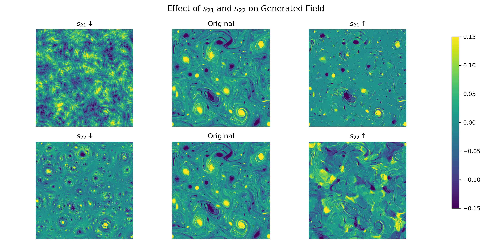

### Scattering Transform Shape–Sparsity Experiments

This repository explores how the 2D scattering transform can be used to study the structural properties of turbulent fields while keeping their power spectrum fixed.  

Here, we varying the second-order scattering coefficients ($s_{21}$, $s_{22}$) of a turbulent flow field which holding the power spectrum fixed to demonstrate how the scattering transform encodes shape and sparsity information of slow fields beyond simple spectral information.  

The code calcualates the scattering transform information of the turbulent field and then uses gradient descent to optimize for fiels with different $s_{21}$ and $s_{22}$ values. 

## Requirements  

- Python 3.10+  
- [Cheng scattering transform code](https://github.com/SihaoCheng/scattering_transform)  
- PyTorch  
- NumPy, SciPy  
- Matplotlib, cmocean  
- netCDF4

## Example Results 
The plots below show how varying $s_{21}$ and $s_{22}$ modifies the structure of a 2D turbulence field while keeping power spectrum fixed:

